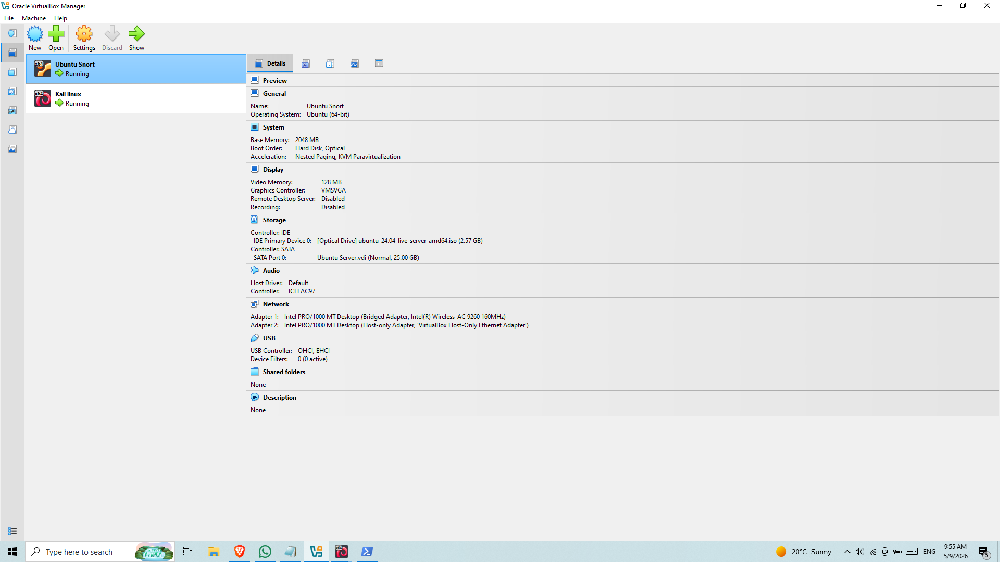
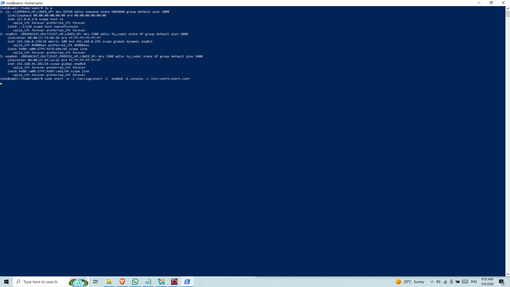
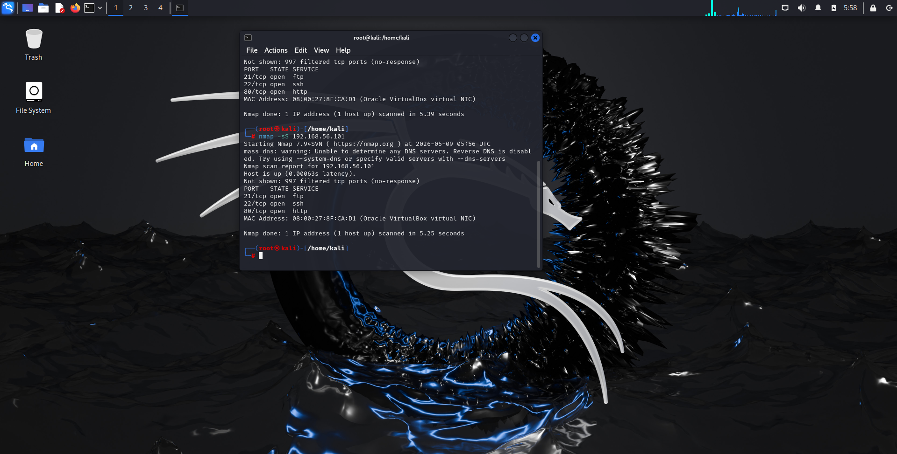
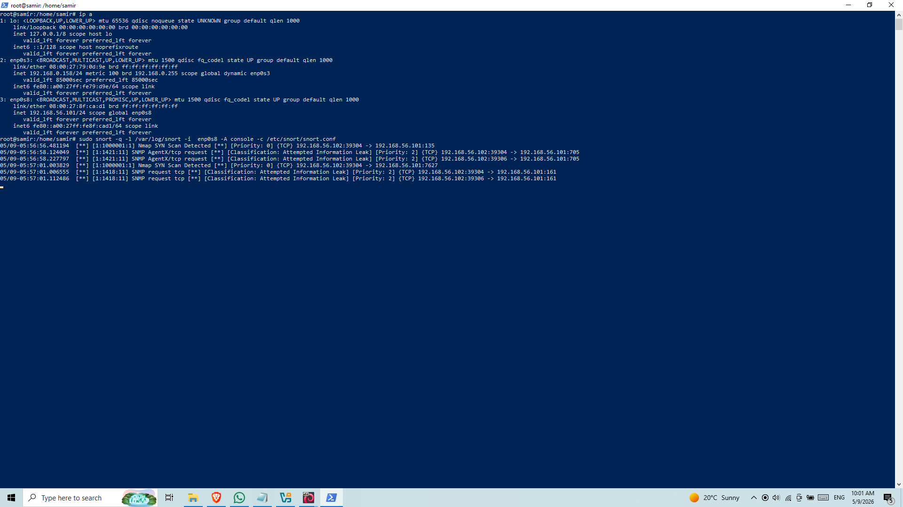

# Detecting Nmap Reconnaissance Using Snort IDS

## Project Description

This project demonstrates a basic Intrusion Detection System (IDS) setup using Snort to detect network reconnaissance activity.

A virtual lab environment was built using VirtualBox with two virtual machines: an Ubuntu Server acting as the target system and a Kali Linux machine used to generate network traffic.

Snort was installed and configured on the Ubuntu Server to monitor network activity on the Host-Only interface.

An Nmap SYN scan was performed from the Kali Linux machine to simulate reconnaissance behavior against the target system.

Snort successfully detected the scan and generated alerts, which were analyzed through its output logs.

This project demonstrates key SOC concepts such as network monitoring, intrusion detection, and analysis of suspicious network activity.

---

## Tools Used

- Snort
- Nmap
- VirtualBox
- Ubuntu Server
- Kali Linux

---

## Lab Architecture

### 1. VirtualBox Environment (Ubuntu Server + Kali Linux)

### 2. Snort Monitoring Active on Ubuntu Server

Snort is running and actively monitoring traffic on the Host-Only interface.

### 3. Nmap Reconnaissance Scan from Kali Linux

A SYN scan was executed from Kali Linux against the target Ubuntu Server to simulate reconnaissance activity.

### 4. Snort Detection of Nmap Scan Activity

Snort successfully detected the scan and generated alerts containing details such as source IP, destination IP, and suspicious behavior type.

---

## Project Outcome

Successfully implemented a working IDS lab using Snort capable of detecting and logging Nmap reconnaissance attempts in a controlled virtual environment.
